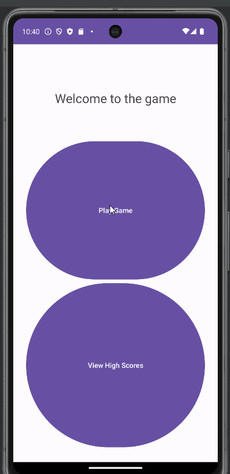

# Midterm Project: Number Guessing App
An Android app/game that generates a random number between 1 and 100, and tells the user if they guessed higher or lower.

## Functionality 

The following **required** functionality is completed:

* [ ] User can guess a number
* [ ] App displays a toast indicating if the number was too big or too small
* [ ] App plays a sound with each toast
* [ ] User is taken back to the main menu when they guess the right number
* [ ] User's name and score are displayed on the main menu
* [ ] User can play again
* [ ] Scores are stored in a database

The following **extensions** are implemented:

* I didn't implement any extensions for this project.

## Video Walkthrough

Here's a walkthrough of implemented user stories:

GIF created with [LiceCap](http://www.cockos.com/licecap/).

## Notes

I tried to store the scores in a database, but they wouldn't actually display for some reason.

## License

    Copyright [2023] [Billy Moore]

    Licensed under the Apache License, Version 2.0 (the "License")
    you may not use this file except in compliance with the License.
    You may obtain a copy of the License at

        http://www.apache.org/licenses/LICENSE-2.0

    Unless required by applicable law or agreed to in writing, software
    distributed under the License is distributed on an "AS IS" BASIS,
    WITHOUT WARRANTIES OR CONDITIONS OF ANY KIND, either express or implied.
    See the License for the specific language governing permissions and
    limitations under the License.
